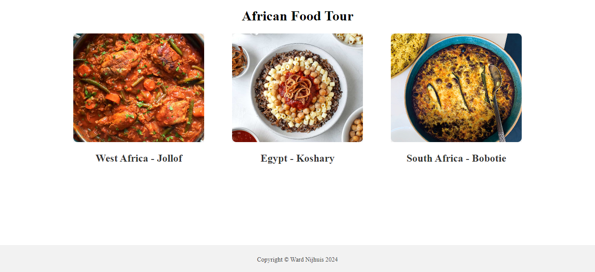
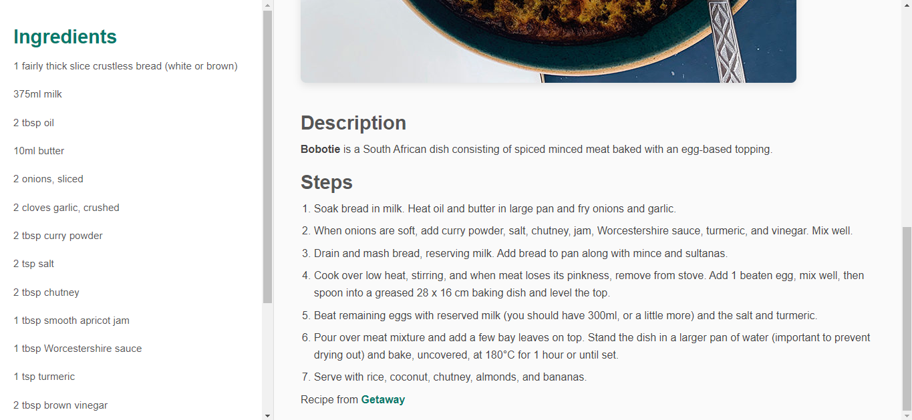

# African Recipes

## Description

A small webpage containing a homepage with links to the recipes and 3 recipes of dishes from around Africa. Each of these pages has a sidebar with the ingredients and a main menu with the recipe. The main menu contains a image, description and a list of steps to make the recipe.

The project is made using only vanilla HTML and CSS, due to the simplicity of the website. Flexbox is used to style both the main page and the recipe pages.

During the project I struggeld with finding authentic recipes, as I do'nt know many people from these countries. I also had difficulty to make the width of the ingredients sidebar the same on every page, whilst using only one CSS file.

In the future I would like to add more recipes to the website, whilst still keeping the layout consistent. I would also like to implement more advanced styles, such as animations and a blurred background image. I would also like to add more responsiveness to the website, especially on the recipe pages, as the homepage is already responsive due to the usage of Flexbox.

## Usage

You can visit the website [here](https://wardnijhuis.github.io/recipes/). From the homepage the user can visit the recipes by clicking on the images or titles of the recipes.

## Credits

Jollof Rice: [Zena's Kitchen](https://zenaskitchen.com/my-mums-jollof-rice/)\
Koshary: [Food Dolls](https://www.fooddolls.com/koshary-recipe/)\
Bobotie: [Getaway](https://www.getaway.co.za/food/recipes-food/traditional-south-african-bobotie-recipe/)

## License

[MIT](https://github.com/wardnijhuis/recipes/blob/main/LICENSE.md)
